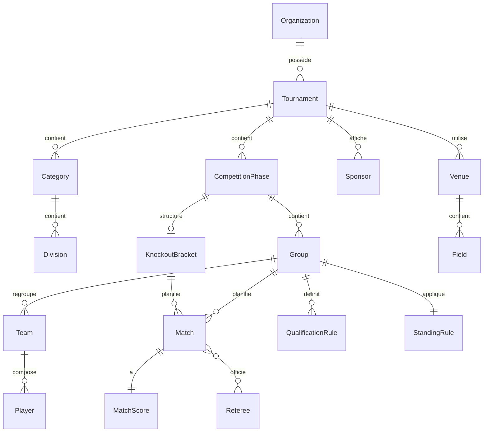

# Modèle de données — proposition initiale

Statut : première proposition (mission §29), basée sur l'audit du site public et le périmètre demandé en §10. Sera révisée après l'audit de l'administration (rôles exacts, règles de départage, gestion des créneaux). Toute entité listée ici respecte les contraintes transverses suivantes (mission §29) : identifiants non prédictibles (UUID), `createdAt`/`updatedAt`, versionnement optimiste (`@Version`), soft-delete/archivage où pertinent, isolation stricte par organisation.

## Entités cœur

### Organisation & utilisateurs
- **User** — compte individuel (email, mot de passe hashé, profil).
- **Organization** — entité propriétaire de tournois.
- **OrganizationMember** — lien `User` ↔ `Organization` avec un `Role` global.
- **Role** — rôle global simple au niveau organisation (`ORG_ADMIN`, `ORG_MEMBER`).
- **Permission** — permission granulaire au niveau tournoi (ex. `MANAGE_GENERAL`, `MANAGE_PARTICIPANTS`, `MANAGE_SCHEDULE`, `MANAGE_PRESENTATION`, `MANAGE_PUBLIC_SITE`, `MANAGE_SLIDESHOW`, `MANAGE_DESIGN`, `MANAGE_SCORES`, `MANAGE_PHASES`) — **modèle confirmé par l'audit admin** (dix permissions booléennes indépendantes observées sur `manage.tournifyapp.com`, cf. `docs/product/roles-and-permissions.md`), pas un enum de rôles fermés.

### Tournoi
- **Tournament** — appartient à une `Organization` ; statuts : brouillon / publié / dépublié / archivé.
- **TournamentAdministrator** — lien `User` ↔ `Tournament` ↔ `Permission[]` (permissions cochées individuellement, conforme au comportement confirmé de la référence). Arena Pulse ajoutera en option des préréglages ("rôle Arbitre" = telle combinaison de permissions) comme amélioration ergonomique non observée dans la référence.
- **Sport** — référentiel (football, basketball, etc.).
- **Category** — regroupement d'âge/niveau au sein d'un tournoi (ex. U10).
- **Division** — sous-niveau optionnel d'une catégorie.

### Compétition
- **CompetitionPhase** — une phase du tournoi (ex. "Phase de poules", "Champions League", "Europa League"). Observé : plusieurs `CompetitionPhase` de type élimination directe peuvent coexister en parallèle après la phase de poules (cf. `business-rules.md`), chacune avec son propre format (nombre de tours, présence ou non d'un match de classement).
- **Group** — une poule au sein d'une `CompetitionPhase` de type championnat (ex. Poule A-D).
- **QualificationRule** — règle liant une position de sortie d'un `Group` (ex. "1er et 2e") à une `CompetitionPhase` cible (ex. "Champions League"). **Confirmé par l'audit admin** : l'écran de structure de compétition matérialise explicitement cette cascade via un bouton "Ajouter une phase" dont l'aide contextuelle décrit exactement ce mécanisme.
- **StandingRule** — définit le barème de points (victoire/nul/défaite, configurable) et l'ordre des critères de départage pour un `Group`. **Confirmé par l'audit admin** : critères observés et réordonnables — nombre de points, différence de buts, buts marqués, confrontation directe (résultat respectif) — plus un classement additionnel optionnel type fair-play/pénalité (`supplementaryStanding`), et une gestion optionnelle des tirs au but pour les rencontres à élimination directe terminées sur un nul.
- **KnockoutBracket** — structure du tableau à élimination directe d'une `CompetitionPhase`, avec un flag `hasRankingMatch` (ex. petite finale) — observé comme différent d'un tableau à l'autre (Champions League oui, Europa/Conférence non).

### Équipes et personnes
- **Team** — appartient à un `Tournament`, rattachée à un `Group`.
- **Player** — optionnel (mission §10.1 : "gestion facultative des joueurs").
- **TeamMember** — lien `Team` ↔ `Player` (ou `User` responsable d'équipe).
- **Referee** — personne pouvant être assignée à des `Match` via `MatchOfficial`.

### Lieux et planning
- **Venue** — site géographique (ex. "Stade Marius Requier, Aix-en-Provence").
- **Field** — terrain rattaché à un `Venue` (ex. "Pelouse 1", "Synthétique 2").
- **TimeSlot** — créneau horaire réservé sur un `Field` pour un `Match`.

### Matchs et résultats
- **Match** — appartient à un `Group` (phase de poules) OU à un `KnockoutBracket` (phase finale), jamais les deux ; référence `Field`/`TimeSlot`, statut (à venir / en direct / terminé / reporté / annulé / forfait).
- **MatchOfficial** — lien `Match` ↔ `Referee`.
- **MatchScore** — score courant, avec distinction score provisoire / validé (mission §10.1), horodatage de validation, auteur de la saisie (audit).
- **Standing** — ligne de classement calculée (J/G/N/P/PTS/PP/PC/+-) pour une `Team` dans un `Group`, recalculée après chaque `MatchScore` validé — donnée dérivée, pas saisie manuellement.

### Communication et suivi public
- **Sponsor** — rattaché à un `Tournament`, avec logo et lien.
- **PublicPageConfiguration** — personnalisation du site public : visibilité par page (cf. écran "Présentation" confirmé côté admin), textes éditoriaux, et un champ **`theme`** (`INK_SIGNAL` / `PULSE_EMBER` / `NEON_COURT`, extensible) choisi par l'organisateur. **Décision validée** (`docs/design/visual-language.md`) : ce thème pilote uniquement le rendu du site public et du mode diaporama de ce tournoi — l'administration et l'application mobile restent toujours dans l'identité produit Arena Pulse fixe (Direction A · Ink & Signal), quel que soit le thème choisi.
- **FollowedTournament** / **FollowedTeam** — suivi favori d'un visiteur (compte ou appareil — mécanisme exact à confirmer, cf. question ouverte #5).
- **NotificationSubscription** — abonnement aux notifications (push mobile / email) pour une `FollowedTeam` ou un `Tournament`.
- **AuditEvent** — journal des actions sensibles (création/modification/suppression de tournoi, saisie/correction de score, changement de rôle, publication/dépublication).

## Contrainte de conception clé

Le classement final global (`docs/product/business-rules.md`) n'est **pas** une entité stockée indépendamment : c'est une vue calculée qui trie les équipes par (rang de `CompetitionPhase` atteinte) puis (étape de sortie dans le `KnockoutBracket` de cette phase). Cette règle sera implémentée comme un calcul de service, pas comme un champ dénormalisé, pour rester cohérente si le format évolue.

## Diagramme relationnel simplifié

## Ce que ce document ne couvre pas encore

Les champs précis (types, contraintes, index) seront spécifiés lors de `feat/003-project-foundation` sous forme de migrations Flyway, une fois l'audit admin réalisé et les questions ouvertes de `assumptions-and-open-questions.md` levées.
